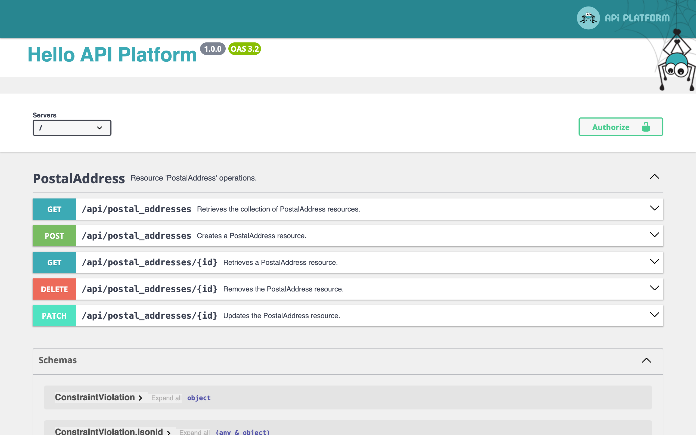
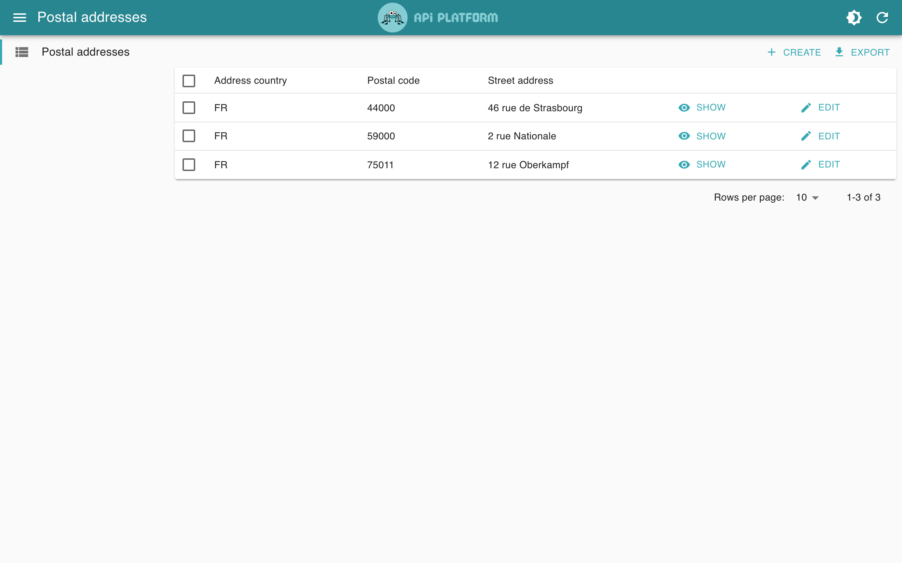
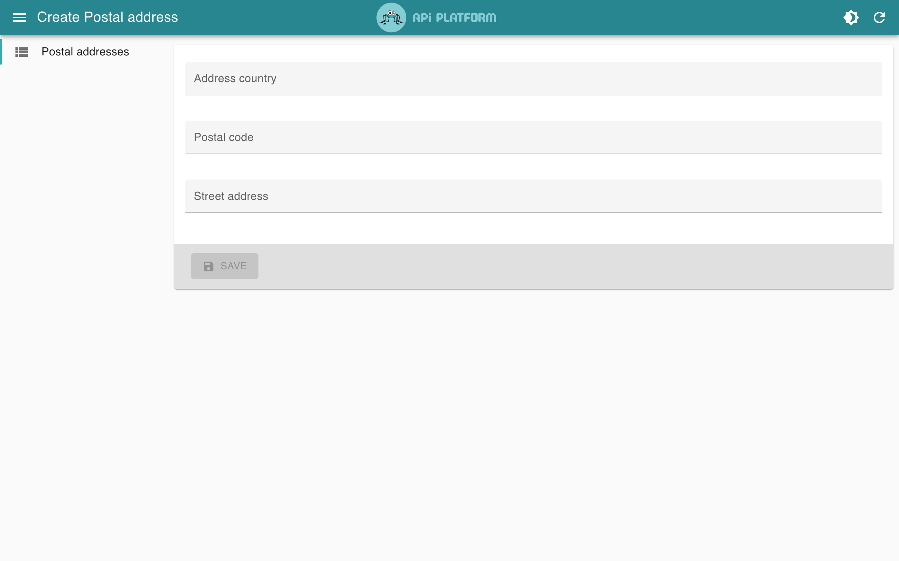

# Formation API Platform 4.4

Projet de départ de la formation : **API Platform 4.4** + **Symfony 7.4** sur [FrankenPHP](https://frankenphp.dev) ([symfony-docker](https://github.com/dunglas/symfony-docker)), PostgreSQL et une **admin React** générée automatiquement.

Tout tourne dans Docker : pas besoin de PHP, Composer ni Node sur votre machine.

## Prérequis

- [Docker](https://docs.docker.com/get-docker/) avec Docker Compose v2.10+
- Git

## Démarrer

```bash
git clone <url-du-dépôt> api-platform-formation
cd api-platform-formation
docker compose build --pull --no-cache
docker compose up --wait
```

Puis ouvrez https://localhost et [acceptez le certificat TLS auto-généré](https://stackoverflow.com/a/15076602/1352334).

| URL | Contenu |
| --- | --- |
| https://localhost/api | Point d'entrée de l'API (Hydra) |
| https://localhost/api/docs | Documentation OpenAPI / Swagger UI |
| https://localhost/admin | Admin React générée depuis la doc Hydra |

Arrêter le projet : `docker compose down --remove-orphans`

## Aperçu

Dès que vous déclarez une ressource (ici l'entité `PostalAddress` des slides), la documentation et l'admin se mettent à jour d'elles-mêmes.

**Documentation OpenAPI** — https://localhost/api/docs



**Admin** — https://localhost/admin





## Structure

```
.
├── compose.yaml            # Services communs : php (FrankenPHP) + database (PostgreSQL)
├── compose.override.yaml   # Dev : montage du code, hot reload, service admin
├── compose.prod.yaml       # Production
├── api/                    # Application Symfony + API Platform
│   ├── config/
│   ├── src/ApiResource/    # Ressources sans Doctrine
│   ├── src/Entity/         # Entités Doctrine
│   └── frankenphp/         # Caddyfile, config PHP, entrypoint
└── admin/                  # Admin React (Vite + @api-platform/admin)
```

Les commandes Symfony se lancent dans le conteneur `php` :

```bash
docker compose exec php bin/console make:entity --api-resource
docker compose exec php bin/console doctrine:schema:update --force
docker compose exec php bin/console debug:api-resource
```

## Ce qui est déjà installé

- `api-platform/symfony` et `api-platform/doctrine-orm` **4.4** (versions figées dans `api/composer.lock`)
- `api-platform/schema-generator` (`vendor/bin/schema`)
- `symfony/maker-bundle`, PHPUnit, `symfony/browser-kit` et `symfony/http-client` pour les tests

## Notes

- **Hot reload** : les modifications de `api/` (PHP, YAML, Twig, `.env`) sont prises en compte sans redémarrer ; l'admin se recharge aussi automatiquement.
- **Cache PropertyInfo** : [`api/config/packages/api_platform_dev_cache.yaml`](api/config/packages/api_platform_dev_cache.yaml) contourne un défaut d'API Platform 4.4 qui, en dev, empêche les propriétés ajoutées ou renommées d'apparaître dans la doc. Si le problème survient malgré tout :
  ```bash
  docker compose exec php bin/console cache:pool:clear cache.property_info
  ```
- **Ports déjà utilisés** (80/443) : `HTTP_PORT=8000 HTTPS_PORT=4443 HTTP3_PORT=4443 docker compose up --wait`, puis https://localhost:4443.
- Copiez les commandes **sur une seule ligne** : un `\` de fin de ligne suivi d'un espace casse la commande.
